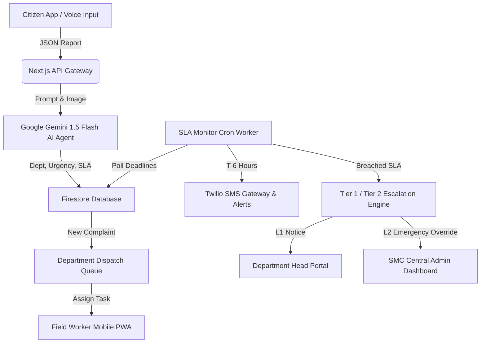

# 🏛️ PARIVARTAN (PS17) — Multi-Agent Municipal Complaint Router with SLA Escalation Engine

[](https://nextjs.org/)
[](https://www.typescriptlang.org/)
[](https://tailwindcss.com/)
[](https://firebase.google.com/)
[](https://ai.google.dev/)
[](https://www.twilio.com/)

**Parivartan** is an enterprise-grade, AI-powered multi-agent municipal complaint resolution platform designed for urban municipal corporations (e.g., PMC/SMC). It solves the systemic challenges of improper complaint routing, missed resolution deadlines, unmonitored SLA breaches, and lack of citizen transparency.

---

## 🎯 Problem Statement (PS17)
Municipal complaints (such as overflowing garbage, pothole repair, water contamination, exposed electrical wiring, broken streetlights, and traffic signal outages) often suffer from:
- ❌ **Manual & Wrong Department Routing**: Complaints bounce between departments.
- ❌ **No Dynamic SLA SLA Enforcement**: Lack of priority-based resolution deadlines.
- ❌ **Silent Expirations & Delayed Escalations**: Overdue complaints go unnoticed without accountability.
- ❌ **Low Citizen Visibility**: Citizens lack transparent tracking of field worker progress and resolution proof.

---

## ✨ Key Features & Innovation

### 🤖 1. Multi-Agent AI Classification & Routing Engine
- **Voice & Text Analysis**: Accepts raw multi-lingual citizen text and voice notes.
- **Gemini AI NLP Pipeline**: Automatically extracts issue category, severity score, damage type, exact ward area, and target municipal department.
- **Duplicate Detection**: Identifies nearby duplicate complaints to prevent resource waste.

### ⏱️ 2. Dynamic Priority & SLA Deadline Engine
- **Automated Deadline Assignment**: Calculates service level timelines based on urgency:
  - 🔴 **Critical Priority**: 6-Hour SLA
  - 🟠 **High Priority**: 12-Hour SLA
  - 🟡 **Medium Priority**: 24-Hour SLA
  - 🔵 **Low Priority**: 48-Hour SLA
- **Field Worker Workload Balancing**: Prevents assigning tasks to overloaded field workers.

### 🔔 3. Automated Pre-Breach Reminders & SLA Escalation Cron
- **6-Hour Pre-Deadline SMS Reminder**: Sends automated Twilio SMS & in-app alerts to field workers 6 hours before deadline expiration (`/api/cron/sla-monitor`).
- **Tier 1 Escalation (Department Head)**: Notifies Department Head when an assigned task exceeds 50% SLA duration without activity.
- **Tier 2 Escalation (SMC Central Admin)**: Auto-escalates breached tasks to Central Administration for emergency override and worker reassignment.

### 👥 4. Multi-Role Municipal Operations Portals
1. **Citizen Portal** (`/citizen`): AI complaint filing, interactive status timeline, worker contact transparency, and citizen feedback rating.
2. **Field Worker Portal** (`/worker`): Mobile PWA dashboard for assigned tasks, navigation route, before/after photo submission, and emergency alert trigger.
3. **Department Head Roster** (`/dept`): Department workload control panel, worker roster management with domain-restricted categories, and overdue task accordion.
4. **SMC Central Admin Dashboard** (`/smc`): City-wide heatmap, department SLA performance scorecards, contractor allocation, and Recharts interactive analytics dashboard.

---

## 🏗️ Architecture Overview



---

## 📂 Documentation Directory (`/docs`)

Comprehensive documentation is available in the [`/docs`](./docs) folder:

- 📐 [**Architecture Guide** (`/docs/ARCHITECTURE.md`)](./docs/ARCHITECTURE.md): System architecture, database schema, multi-agent AI flow, and security model.
- ⚙️ [**Implementation Details** (`/docs/IMPLEMENTATION.md`)](./docs/IMPLEMENTATION.md): API routes, SLA matrix, Twilio SMS engine, and worker roster logic.
- 📊 [**Feasibility & Municipal Impact** (`/docs/FEASIBILITY_AND_IMPACT.md`)](./docs/FEASIBILITY_AND_IMPACT.md): Municipal ROI, cost efficiency, scalability analysis, and deployment architecture.
- 🎬 [**Demo & Presentation Guide** (`/docs/DEMO_WALKTHROUGH.md`)](./docs/DEMO_WALKTHROUGH.md): 3-minute pitch script, test user credentials, and SLA breach simulation trigger.

---

## 🛠️ Tech Stack & Dependencies

- **Frontend**: Next.js 15 (App Router), React 19, TailwindCSS, Shadcn UI, Lucide Icons, Recharts.
- **Backend & Database**: Firebase Firestore, Next.js API Routes, Serverless Functions.
- **Artificial Intelligence**: Google Gemini 1.5 Flash API (`@google/genai`).
- **Communication & Cron**: Twilio REST API (SMS notifications), Vercel Cron Jobs.
- **Maps & Location**: Leaflet.js / OpenStreetMap integration.

---

## 🚀 Quick Start Guide

### 1. Prerequisites
- Node.js 18.x or 20.x
- npm or yarn

### 2. Installation
```bash
git clone https://github.com/parivartan-karu/ps17.git
cd ps17
npm install
```

### 3. Environment Setup (`.env.local`)
Create a `.env.local` file in the root directory:

```env
# Firebase Configuration
NEXT_PUBLIC_FIREBASE_API_KEY=your_firebase_api_key
NEXT_PUBLIC_FIREBASE_AUTH_DOMAIN=your_project.firebaseapp.com
NEXT_PUBLIC_FIREBASE_PROJECT_ID=your_project_id
NEXT_PUBLIC_FIREBASE_STORAGE_BUCKET=your_project.appspot.com
NEXT_PUBLIC_FIREBASE_MESSAGING_SENDER_ID=your_sender_id
NEXT_PUBLIC_FIREBASE_APP_ID=your_app_id

# Google Gemini AI API
GEMINI_API_KEY=your_gemini_api_key

# Twilio SMS Credentials (Optional for local trial)
TWILIO_ACCOUNT_SID=your_twilio_account_sid
TWILIO_AUTH_TOKEN=your_twilio_auth_token
TWILIO_PHONE_NUMBER=your_twilio_phone_number

# Security Cron Secret
CRON_SECRET=parivartan_cron_secret_2026_super_secure
```

### 4. Running Locally
```bash
npm run dev
```
Open [http://localhost:3000](http://localhost:3000) in your browser.

---

## 👥 Demo Test Accounts

| Role | Portal URL | Login Credentials |
| :--- | :--- | :--- |
| **Citizen** | `/citizen/dashboard` | Public Access / Mobile Login |
| **Department Head (Garbage)** | `/dept/login` | Dept Head Roster Access |
| **Field Worker** | `/worker/login` | Worker ID & Password |
| **SMC Central Admin** | `/smc/dashboard` | Municipal Admin Access |

---

## 📄 License
This project is built for the Municipal Innovation Hackathon (Problem Statement PS17). All rights reserved.