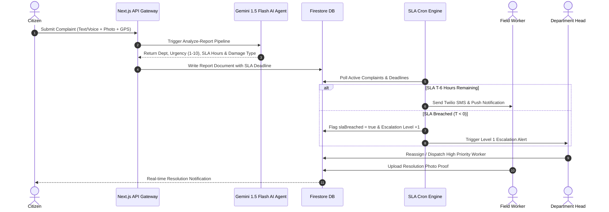

# 📐 System Architecture — Parivartan (PS17)

## 1. Executive System Overview
**Parivartan** is an AI-native multi-agent municipal service platform designed for high-density urban local bodies. It operates as a decoupled microservices architecture deployed on Next.js 15 App Router with serverless edge functions and real-time document synchronization through Firebase Firestore.

---

## 2. Multi-Agent AI System Architecture



---

## 3. Database Schema & Data Models

### 3.1 `reports` Collection (Firestore Document)
```json
{
  "id": "RPT_8941203",
  "category": "Solid Waste",
  "department": "Solid Waste Management Department",
  "departmentId": "dept_sanitation",
  "description": "Overflowing garbage dump near main market gate causing odor.",
  "location": "Main Market Road, Ward 14",
  "latitude": 18.5204,
  "longitude": 73.8567,
  "status": "In Progress",
  "priority": "High",
  "urgencyScore": 8,
  "slaHours": 12,
  "slaDeadline": "2026-09-12T18:00:00.000Z",
  "slaBreached": false,
  "escalationLevel": 0,
  "assignedWorkerId": "WRK_4021",
  "assignedContractor": "PMC Clean Garbage Corp",
  "timestamp": "2026-09-12T06:00:00.000Z",
  "imageUrl": "https://storage.googleapis.com/...",
  "resolutionImageUrl": "https://storage.googleapis.com/...",
  "actionLog": [
    {
      "status": "Submitted",
      "timestamp": "2026-09-12T06:00:00.000Z",
      "updatedBy": "Citizen User"
    },
    {
      "status": "Assigned",
      "timestamp": "2026-09-12T06:15:00.000Z",
      "updatedBy": "Garbage Dept Head"
    }
  ]
}
```

### 3.2 `users` Collection (Firestore Document)
```json
{
  "uid": "WRK_4021",
  "name": "Ramesh Kumar",
  "phoneNumber": "9876543210",
  "role": "worker",
  "department": "Solid Waste Management Department",
  "departmentId": "dept_sanitation",
  "designation": "Garbage Truck Driver",
  "skillType": "Garbage Collection",
  "assignedContractor": "PMC Clean Garbage Corp",
  "wardArea": "Ward 14 - Kothrud",
  "activeTasks": 2,
  "maxTaskCapacity": 5,
  "employeeId": "PMC-WRK-1092"
}
```

---

## 4. Canonical Department Taxonomy & Normalization Engine

Parivartan implements a **Single Source of Truth Department Taxonomy** (`src/lib/departments.ts`) to handle variations in user input and legacy alias names:

| Canonical ID | Display Name | Supported Domains | Key Roles |
| :--- | :--- | :--- | :--- |
| `dept_sanitation` | Sanitation & Solid Waste | Garbage, Illegal Dumping, Sweeping | Garbage Truck Driver, Collector |
| `dept_engineering` | Engineering & Roads | Potholes, Asphalt Damage, Footpaths | Road Repair Worker, Civil Builder |
| `dept_electrical` | Electrical | Streetlights, Wiring, Transformers | Streetlight Technician, Electrician |
| `dept_water` | Water Supply & Drainage | Pipe Leaks, Drainage, Water Quality | Plumber, Pipeline Technician |
| `dept_parks` | Parks & Environment | Fallen Trees, Overgrown Branches | Gardener, Tree Worker |
| `dept_traffic` | Traffic & Signals | Signal Outages, Road Markings | Signal Tech, Safety Officer |
| `dept_public_works` | Public Works | Civic Buildings, Infrastructure | Project Manager, Technician |

---

## 5. Security & Authentication Architecture

1. **RBAC Security Guard** (`src/components/auth-guard.tsx`):
   - Strict role-based route protection enforcing separation of duties between Citizens, Field Workers, Department Heads, and SMC Admins.
2. **Stateless Authorization Tokens**:
   - Secure Bearer token extraction via custom auth headers (`src/lib/client-auth.ts`).
3. **Cron Worker Authorization**:
   - Background execution protected by secret request headers (`CRON_SECRET`).
