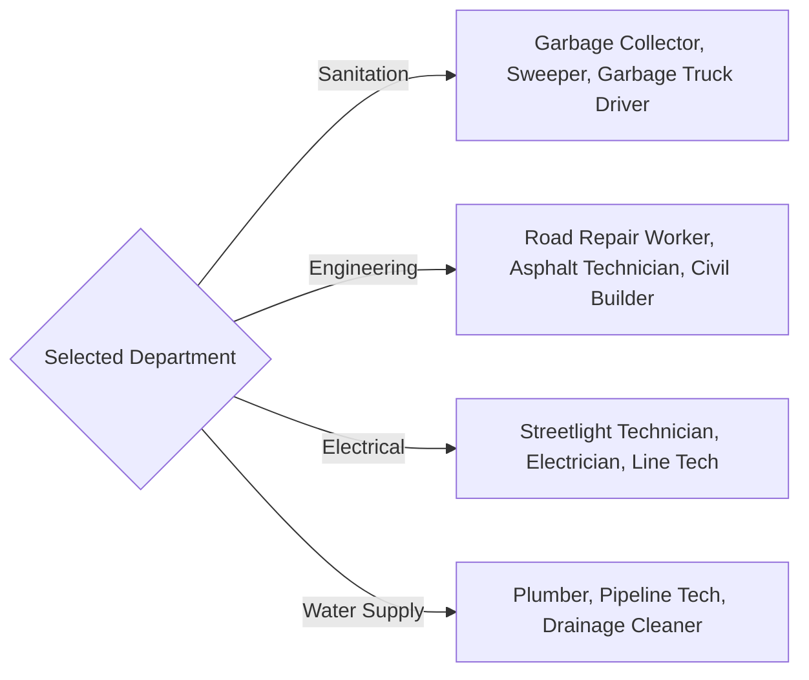

# ⚙️ Implementation & Feature Reference — Parivartan (PS17)

## 1. Dynamic SLA Rules Matrix & Calculator Engine

The SLA Calculator (`src/app/api/dept/complaints/[id]/assign/route.ts`) computes precise service level resolution deadlines at the exact moment of task assignment:

$$\text{SLA Deadline} = \text{Current Timestamp} + \text{SLA Duration Hours}(\text{Priority})$$

### Priority & SLA Matrix
| Assigned Priority | Urgency Score (1-10) | Target SLA Duration | Reminder Trigger (T-Minus) |
| :--- | :---: | :---: | :---: |
| 🔴 **Critical** | $9 - 10$ | **6 Hours** | 3 Hours before expiry |
| 🟠 **High** | $7 - 8$ | **12 Hours** | 6 Hours before expiry |
| 🟡 **Medium** | $4 - 6$ | **24 Hours** | 6 Hours before expiry |
| 🔵 **Low** | $1 - 3$ | **48 Hours** | 12 Hours before expiry |

---

## 2. API Endpoints Specification

### 2.1 Complaint NLP Analysis Engine
`POST /api/analyze-report`
- **Purpose**: Processes citizen input using Google Gemini AI.
- **Request Body**:
  ```json
  {
    "description": "Large pothole on Karve Road near Nal Stop",
    "imageBase64": "data:image/jpeg;base64,..."
  }
  ```
- **Response**:
  ```json
  {
    "category": "Road Damage",
    "department": "Engineering",
    "departmentId": "dept_engineering",
    "priority": "High",
    "urgencyScore": 8,
    "suggestedSlaHours": 12
  }
  ```

### 2.2 Worker Task Assignment & SLA Calculator
`POST /api/dept/complaints/[id]/assign`
- **Purpose**: Assigns complaint to a field worker, calculates SLA deadline, and dispatches notification.
- **Request Body**:
  ```json
  {
    "workerId": "WRK_4021",
    "priority": "High"
  }
  ```

### 2.3 SLA Monitor Cron Gateway
`GET /api/cron/sla-monitor`
- **Headers**: `Authorization: Bearer <CRON_SECRET>`
- **Behavior**:
  1. Scans active complaints across Firestore (`Assigned`, `In Progress`).
  2. Evaluates time remaining: $\text{Time Remaining} = t_{\text{deadline}} - t_{\text{now}}$.
  3. Triggers Twilio SMS to field workers when $0 < t_{\text{remaining}} \le 6\text{ hours}$.
  4. Triggers Level 1/Level 2 Escalation when $t_{\text{remaining}} < 0$.

### 2.4 Worker Account Registration
`POST /api/smc/workers`
- **Purpose**: Registers a field worker account with strict department domain isolation.
- **Response**:
  ```json
  {
    "workerId": "WRK_9041",
    "password": "AutoGeneratedPassword123",
    "smsStatus": "sent"
  }
  ```

---

## 3. Department Roster Domain Restrictions

To prevent misconfiguration, worker registration (`src/app/dept/workers/page.tsx` & `src/lib/departments.ts`) dynamically filters roles and skill categories by department:



---

## 4. Recharts Interactive Analytics Dashboard

The Admin Analytics page (`/smc/analytics`) renders real-time urban management insights:
- **Timeline Area Chart**: Dual-layer trend of submitted vs. resolved complaints over 7d, 30d, 90d, or All Time.
- **SLA Compliance vs. Resolution Rate Bar Chart**: Side-by-side department benchmark comparing SLA on-time percentage against overall resolution rate.
- **Active Workload vs. Overdue Backlog Bar Chart**: Grouped bar visualization highlighting bottleneck departments.
- **Department Performance Scorecard Table**: Granular breakdown of active queue, total resolved, SLA breaches, and health status badges (`Optimal`, `At Risk`, `Critical SLA Breach`).
